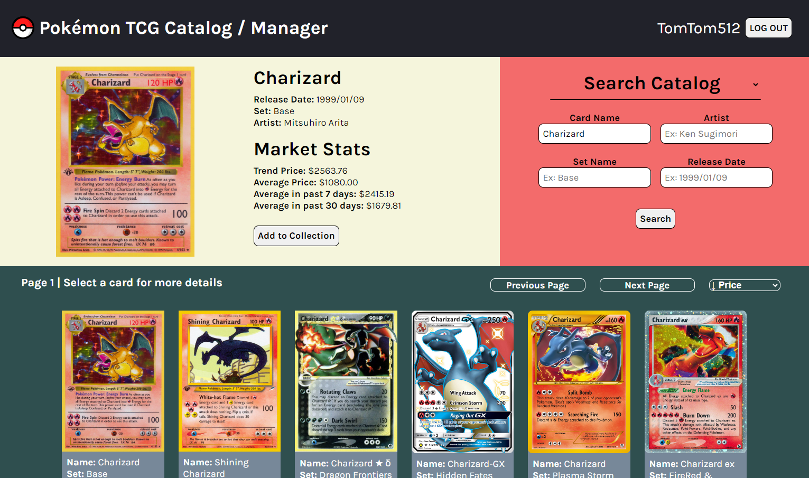

<h1> Pokémon TCG Catalog / Manager </h1>

A Pokémon TCG lookup created with React

<h2> Features </h2>
<ul>
    <li> Users can search for a card’s information and market value from an API provided by 
        <a href="https://pokemontcg.io" target="_blank" rel="noopener noreferrer"> 
            Pokémon TCG Developers 
        </a>
    </li>
    <li> Users may also create an account to store a personal collection, managed by Flask and SQLite </li>
</ul>

<h2> Future implementation goals </h2>
<ul>
    <li> Sort collection by price </li>
    <li> Display account statistics </li>
</ul>